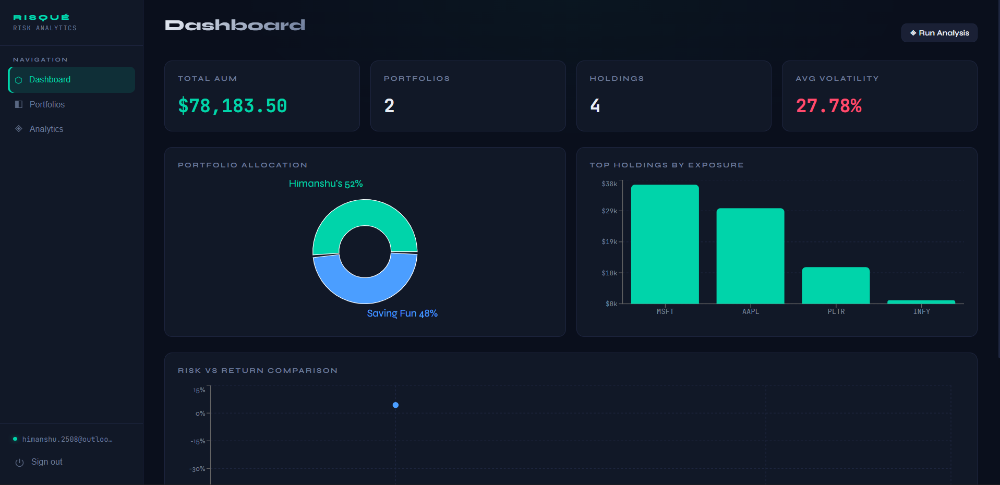
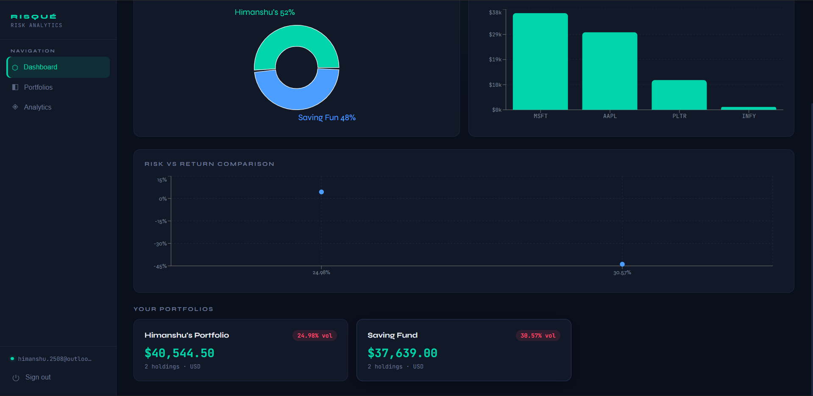
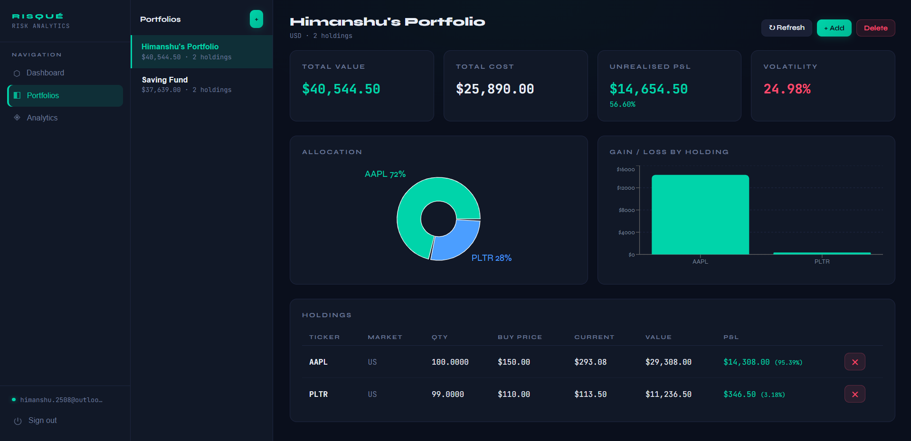
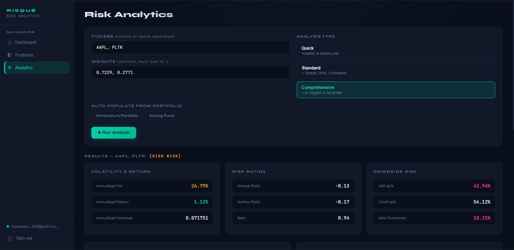
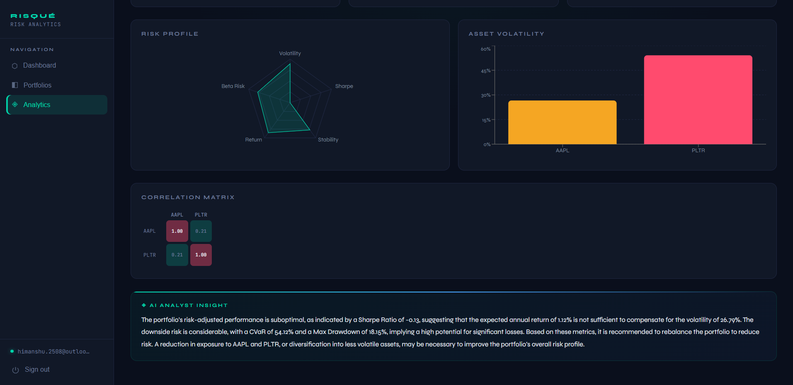

# Portfolio Risk Analytics

This repository serves as the root container for the Portfolio Risk Analytics platform. To maintain a clean separation of concerns, the project utilizes a micro-repository architecture managed via Git submodules. 

## What it does

* **Portfolio Management:** Users can create portfolios and manage individual stock holdings. 
* **Market Data Integration:** The backend integrates with the Alpha Vantage API to retrieve up-to-date stock data.
* **Risk Analysis:** The platform evaluates portfolios and calculates specific risk metrics, displaying results visually on a dedicated analytics dashboard.
* **Secure Access:** User sessions are secured using JWT (JSON Web Tokens) authentication.
* **User Notifications:** The system includes backend email services and handles OTP (One-Time Password) requests for account verification.
* **AI Capabilities:** The backend includes configuration for a chat client, facilitating AI-driven portfolio analysis.

## The Stack

* **Frontend:** Built with React and Vite. It features custom hooks for state management and a component-based UI that includes modals, stat cards, and sidebars.
* **Backend:** Developed using Java and Spring Boot. It utilizes Maven for dependency management and follows a structured controller-service-repository architecture.

## Setup

Because this repository relies on Git submodules, a standard Git clone operation will only pull the root directory structure and leave the submodule folders empty. Follow the instructions below to properly initialize the entire project workspace.

### 1. Initial Clone

To clone this repository and automatically fetch the underlying source code for both the frontend and backend submodules in a single step, use the `--recurse-submodules` flag:

```bash
git clone --recurse-submodules [https://github.com/singh-imanshu/portfolio-risk-analytics.git](https://github.com/singh-imanshu/portfolio-risk-analytics.git)
```

### 2. Updating an Existing Clone

If you have already cloned the repository using a standard `git clone` command (without the recursive flag), your `risque_frontend` and `risque_backend` directories will be empty. 

To resolve this, initialize and update the submodules by executing the following command from the root directory of the project:

```bash
git submodule update --init --recursive
```
## Screenshots

### Dashboard

<p align="center">
  
  
</p>

### Portfolio Management

<p align="center">
  
</p>

### Analytics

<p align="center">
  
  
</p>
